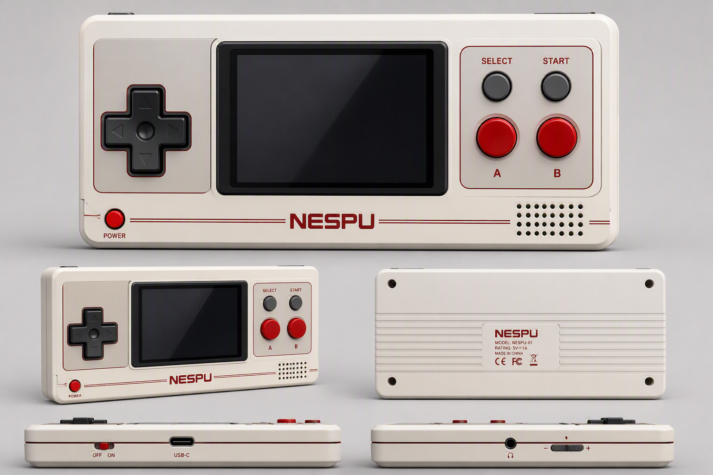

[中文](README_CN.md) | English

# NES BOX — ESP32-S3 Handheld NES Game Console

A NES emulator handheld based on the Waveshare ESP32-S3-Touch-AMOLED-2.41 dev board, featuring 600×450 AMOLED full-screen display, LVGL game launcher UI, I2S audio output, ESP-NOW 2-player netplay, and **TCA9554 vibration motor feedback**.



## BOM (Bill of Materials)

| Component | Model/Spec | Qty | Purpose |
|-----------|-----------|-----|---------|
| Main Board | Waveshare ESP32-S3-Touch-AMOLED-2.41 | 1 | MCU + Display + Touch + PMU |
| I2C GPIO Expander | TCA9554 Module | 1 | GPIO expansion (motor driver) |
| Vibration Motor | 1027 Flat / 1020 Coin Motor | 1 | Game vibration feedback |
| NPN Transistor | S8050 / 2N2222 | 1 | Motor driver (GPIO can't drive directly) |
| Flyback Diode | 1N4148 / 1N4007 | 1 | Circuit protection (across motor) |
| Resistor | 1kΩ (base current limit) | 1 | Transistor base resistor |
| Resistor | 10kΩ (pull-down) | 1 | Ensure base is low when off |
| SD Card | MicroSD, FAT32, ≥1GB | 1 | Store game ROMs and sound effects |
| Speaker | 8Ω 1-3W | 1 | I2S amplifier output |
| Physical Buttons | 6×6mm Tactile Switch | 9 | UP/DOWN/LEFT/RIGHT/A/B/SELECT/START/QUIT |
| I2S Amplifier | MAX98357A Module | 1 | Audio amplification |
| Li-Po Battery | 3.7V, ≥400mAh | 1 | Power supply |
| Dupont Wires / Headers | — | various | Connect peripheral modules |

### Motor Driver Circuit

```
ESP32/TCA9554 GPIO ──[1kΩ]──┬─── B (S8050)
                             │
GND ──────────────────────── E
                             │
                     ┌─ Motor ─┐
                     │         │
                     │   ┌─── C
                     │   │
           VCC ──────┴───┤◁ 1N4148 (Flyback)
                         └─── GND
```

## Hardware

- **MCU**: ESP32-S3 (240MHz, 8MB Flash, PSRAM)
- **Display**: 2.41" AMOLED, 600×450 touch screen
- **Audio**: MAX98357A I2S Amplifier
- **Storage**: MicroSD Card (FAT32, SPI 40MHz)
- **Power**: SY6970 PMU + Li-Po Battery
- **Vibration**: TCA9554 I2C GPIO Expander + Motor Driver Circuit

## Features

### Gaming
- NES emulation with 34 mappers (arduino-nofrendo core)
- Full-screen scaling (256×240 → 600×450, nearest-neighbor algorithm)
- Full APU audio (I2S PCM output, 22050Hz 16-bit)
- Physical buttons + on-screen touch gamepad (8 buttons + quit)
- In-game pause menu (swipe-down gesture, brightness & volume adjustment)
- Battery level display (menu bar + in-game overlay)
- **Vibration feedback: motor pulses 180ms on player damage, combo hits extend duration**
- **30+ games with preset HP addresses, auto-match by ROM filename**
- **HP scan debug tool (`-DHP_SCAN_ENABLE`), supports custom game HP address discovery**
- Long-press power button to turn on
- Press reset button to shut down

### UI
- LVGL game selector (card carousel / list dual mode)
- Splash screen with real-time game scanning
- Game list cache (`.cache` file, instant load on subsequent boots)
- Navigation sound effects (`/game/music/select.pcm` + `start.pcm`)

### Settings
- Screen brightness (5-255)
- Volume (0-21, controls both UI SFX and game audio)
- Screen rotation 180°
- Online netplay toggle
- Clear game cache (rescan games)
- Persistent settings (`/game/settings.cfg`)
- In-game settings, swipe down to open panel

### HP RAM Address Scanning
- Enable `-DHP_SCAN_ENABLE` in `platformio.ini`, play normally, and the system auto-collects damage/death data to track HP addresses
- Results are saved to (`/game/game_profile.cfg`)

### Netplay
- ESP-NOW wireless communication
- Auto HOST/CLIENT negotiation
- 6-frame input delay buffer
- CRC desync detection
- Auto-exit on disconnection

## Build

```bash
pio run              # Compile
pio run -t upload    # Compile & flash
pio device monitor -b 115200  # Serial monitor
```

### Debug Options

```ini
; Add to platformio.ini build_flags:
-DHP_SCAN_ENABLE     # Enable HP address scanner (serial output of candidate addresses)
```

## Directory Structure

```
NES_BOX/
├── src/
│   ├── mian.cpp              # Main entry, setup/loop, LVGL, buttons, settings
│   ├── game_ui.cpp           # Game selection UI (card/list)
│   ├── nes_launcher.cpp      # NES emulator FreeRTOS task wrapper
│   ├── nofrendo_osd.cpp      # OSD layer: video driver, audio, input, pause menu
│   ├── audio_player.cpp      # MP3 SFX + PCM playback wrapper
│   ├── touch_gamepad.cpp     # On-screen touch gamepad
│   ├── damage_detector.cpp   # Damage detection (NES RAM HP monitoring)
│   ├── motor_controller.cpp  # Vibration motor driver (TCA9554 I2C)
│   ├── game_profile_store.cpp# SD-based HP profile persistence
│   └── hp_scan.c             # HP address scanner (debug tool)
├── include/
│   ├── game_ui.h             # LVGL UI
│   ├── nes_launcher.h        # NES launcher
│   ├── game_profile_store.h  # HP RAM scan storage
│   ├── touch_gamepad.h
│   ├── damage_detector.h     # Damage detection interface
│   ├── motor_controller.h    # Motor control interface
│   ├── game_profiles.h       # Game HP address database (30+ games)
│   ├── hp_scan.h             # HP scan interface
│   ├── lv_conf.h             # LVGL config
│   └── config.h              # Pin definitions
├── lib/
│   ├── AMOLED/               # Ws_AMOLED display driver
│   ├── arduino-nofrendo/     # NES emulator core (34 mappers)
│   ├── TCA9554EXIO/          # TCA9554 I2C GPIO expander driver
│   ├── XPowersLib/           # PMU driver (SY6970)
│   ├── SensorLib/            # Sensor drivers
│   └── MultiplePlayer/       # ESP-NOW netplay
├── platformio.ini
├── CLAUDE.md
├── LICENSE
└── README.md
```

## Pinout

| Function | GPIO | Notes |
|----------|------|-------|
| SD MISO | 6 | |
| SD MOSI | 5 | |
| SD CLK | 4 | |
| SD CS | 2 | |
| BTN UP | 1 | |
| BTN DOWN | 7 | |
| BTN LEFT | 8 | |
| BTN RIGHT | 18 | |
| BTN A | 38 | |
| BTN B | 39 | |
| BTN SELECT | 40 | |
| BTN START | 41 | |
| BTN QUIT | 43 | Exit to menu in-game |
| I2S BCLK | 45 | MAX98357A |
| I2S LRC | 42 | MAX98357A |
| I2S DOUT | 46 | MAX98357A |
| I2C SDA | 47 | TCA9554 + PMU / Touch |
| I2C SCL | 48 | TCA9554 + PMU / Touch |
| MOTOR (TCA9554 P7) | EXIO bit 7 | Vibration motor (via TCA9554 I2C expander) |
| BAT Control | 16 | Battery power hold |
| BAT ADC | 17 | Battery voltage detection |
| Key BAT | 15 | Power button |
| MOTO_PIN_EXIO | 7 | Vibration motor uses expanded IO 7 |

## Vibration System Architecture

```
Core 1 (Emulator, ~60fps):
  scaleAndPush()
    ├── damageDetector_update()
    │     ├── First frame: match ROM filename → game_profiles.h or SD:/game/game_profile.cfg → determine HP address
    │     ├── Each frame: read nes_getcontextptr()->cpu->mem_page[0][addr]
    │     └── Value drops → g_damageDetected = true
    └── motorController_update()
          ├── g_damageDetected → exio_set_bit(7) → Motor ON
          ├── Frame count 11 (~180ms) → exio_clear_bit(7) → Motor OFF
          └── Combo hits: frame counter resets (extends vibration)

I2C: TCA9554 exclusively on I2C_NUM_0 (GPIO 47/48), same-core serial with touch I2C, no contention
```

### Supported Games (game_profiles.h)

| Genre | Games |
|-------|-------|
| Platformer | Super Mario, Mega Man 1-6, Castlevania, Ninja Gaiden, Duck Tales, Battletoads, Ghosts 'n Goblins, Double Dragon III, Bubble Bobble, Batman, Chip 'n Dale 1-2, Adventure Island 1-3, Little Nemo |
| Action-Adventure | Zelda II, Metroid, Kirby, TMNT III, Punch-Out, Shadow of the Ninja, Kid Icarus, Ice Climber, Toki |
| Shooter | Contra, Gradius, Life Force, Star Wars |
| RPG | Final Fantasy |

Unmatched games do not trigger vibration. Use `-DHP_SCAN_ENABLE` to scan new game addresses and add them to `game_profiles.h`.

## SD Card File Structure

```
/game/
├── settings.cfg               # Settings file (brightness, volume, online, rotate)
├── game_profile.cfg           # Auto-learned HP addresses
├── nes/
│   ├── game1.nes
│   ├── game2.nes
│   └── .cache                 # Game list cache
├── music/
│   ├── power_up.mp3           # Boot sound
│   ├── select.mp3             # Navigation SFX (source)
│   ├── select.pcm             # Navigation SFX (preloaded PCM)
│   ├── start.mp3              # Launch SFX (source)
│   └── start.pcm              # Launch SFX (preloaded PCM)
├── img/
│   ├── game1.png
│   ├── game2.png
└── nofrendo.cfg               # Emulator config (stub)
```

## Audio Preprocessing

```bash
# Convert MP3 to raw PCM (zero-latency playback)
ffmpeg -i select.mp3 -f s16le -acodec pcm_s16le -ac 1 -ar 22050 select.pcm
ffmpeg -i start.mp3  -f s16le -acodec pcm_s16le -ac 1 -ar 22050 start.pcm
```

## Dependencies

| Library | Purpose |
|---------|---------|
| lvgl @ 8.4.0 | UI Framework |
| esphome/ESP32-audioI2S @ ^2.3.0 | MP3 decode & playback |
| arduino-nofrendo | NES emulator core |
| TCA9554EXIO | TCA9554 I2C GPIO expander driver |
| Ws_AMOLED | AMOLED display driver |
| XPowersLib | PMU power management |
| SensorLib | Sensor drivers |
| Arduino SD / SPI / FS | SD card filesystem |

## Architecture

```
Core 0 (UI):      LVGL menu + input handling + SFX playback
Core 1 (Emulator): Nofrendo blocking loop → video scaling output + APU audio
                   + damage detection + motor control (same-core I2C)

Video:  Nofrendo PPU → 256×240 palette indices → RGB565 → 600×450 upscale → pushColors()
Audio:  Nofrendo APU → mono PCM → stereo duplicate → i2s_write() → MAX98357A
Input:  osd_getinput() on Core 1 direct digitalRead() GPIO → event system
Vibration: damageDetector → nes_getcontextptr() RAM monitoring → TCA9554 I2C → motor driver
Netplay: ESP-NOW → netplay_sync_frame() → dual input merging
```

## Contributors

Thanks to <a href="https://github.com/Fineman007">Fineman007</a> for hardware support!

## License

[MIT](LICENSE)
